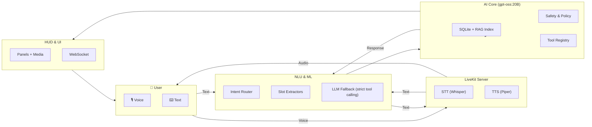

# Jarvis AI HUD — Master Build Document

**Branch:** `feature/nlu-agent-integration`  
**Latest commit:** _14bfb2d (branch: feature/nlu-agent-integration)_  
_Fallback tag:_ `fallback-spotify-stable-2025-08-12`  

> For a slim, auto-run version for Cursor, see **`cursor_build.md`**.

---

## 🛠 Build Execution Mode (Auto-Continue)
**Do not stop for user approval — run all tasks in order until all are complete.**  
- After each passing test → immediately continue to the next task.  
- If a test fails → debug and retry until it passes before moving forward.  
- Commit locally after each logical block using the templates below.  
- **Never push to `main`** from this branch.

### Always run tests before committing
```
cd jarvis-tools && npm run test
cd server && pytest
```
Post-commit hook updates `cursor.json` automatically when tests are green.

---

## ⚡ Quick Start for New Devs / AIs
1) Ensure **Ollama** is running and model is available: `ollama serve` + `ollama pull gpt-oss:20b`  
2) Term A: `cd server && npm i && npm run dev` (NLU/Agent on `http://localhost:7071`)  
3) Term B: `cd jarvis-tools && npm i && npm run test:router` (router sanity)  
4) HUD posts text to: `POST http://localhost:7071/agent/route`  
5) Dry-run shows: _“Plan: <tool>(<params>) — Confirm?”_ → Confirm to execute in HUD/Player.

---

## 🎯 Vision & Goals
A local, privacy-respecting AI assistant powered by **gpt-oss:20B** that:  
- Understands Swedish NLU precisely (rules-first + strict tool calling fallback)  
- Learns and adapts (SQLite memory + RAG)  
- Speaks and listens (LiveKit, Whisper, Piper)  
- Controls media/HUD/IoT with safety guardrails and confirmation flow

---

## ✅ Historical Progress (Completed)
**Core Foundation**
- ✅ AI brain (`gpt-oss:20B` via Ollama)
- ✅ Persistent memory (SQLite)
- ✅ Tool registry & Command Bus
- ✅ WebSocket + FastAPI communication
- ✅ HUD controls (media/weather/to-do/diagnostics)

**NLU Basics**
- ✅ Swedish lexicons; slots for **time/volume**
- ✅ Rule-first router + strict Zod validation
- ✅ Agent endpoints: `/nlu/extract`, `/classify`, `/agent/route`
- ✅ NONE-policy + fallback logging for improvement

**Spotify + HUD Media**
- ✅ OAuth setup, auto-init, seamless playback
- ✅ Intent routing HUD → Agent → Tools
- ✅ Safe Boot (mic/cam off by default)

---

## 🧠 Architecture (High Level)


---

## 4) Master Build Checklist (Phases with paths, commands, commit templates)

### Phase 1 — NLU Finalization (Underway)

**Goal:** Slot coverage (time/volume/room/device), robust routing, measurable quality.  
**Target KPIs:** Slot-F1 ≥ **0.90**, latency p50 < **120ms** (no LLM), “refuse when unsure” ≥ **95%**.

| Step | What | Path | Accept Criteria | Command | Commit Message Template |
|------|------|------|------------------|---------|-------------------------|
| 1 | **Room slot extractor** | `jarvis-tools/src/router/slots.ts` (new helpers) | “vardagsrummet/köket/sovrummet/kontoret” → `{room:"..."}` | `npm test slots-room` | `feat(nlu): room slot extractor [DONE]` |
| 2 | **Device/media slot extractor** | `jarvis-tools/src/router/slots.ts` + `src/lexicon/devices.json` | “tv/högtalare/spotify/chromecast” → `{device:"..."}`; alias → canonical | `npm test slots-device` | `feat(nlu): device slot extractor + alias map [DONE]` |
| 3 | **Router mapping (TRANSFER/CAST)** | `jarvis-tools/src/router/router.ts` | “casta/spela på X (rum|device)” → `TRANSFER {device}` (canonical) | `npm test router-cast` | `feat(router): transfer mapping + canonical device resolve [DONE]` |
| 4 | **Agent use of slots & memory** | `nlu-agent/src/index.ts` | Uses room/device slots, saves last choice; prefers user’s previous device | `npm run dev` | `feat(agent): prefer canonical device + shortTerm memory [DONE]` |
| 5 | **Unit tests** | `jarvis-tools/tests/` + `server/tests/` | ≥10 time, ≥6 volume, ≥6 room/device | `npm test && pytest tests/nlu/` | `test(nlu): expand slot/room/device coverage [PASS]` |
| 6 | **RAG-light for fallback** | `server/src/rag/` | Low-confidence → retrieve top-K via BM25+recency; attached to LLM context | `pytest tests/rag/` | `feat(rag): BM25+recency retrieval for LLM fallback [DONE]` |
| 7 | **Quality metrics & eval** | `server/nlu/src/eval.ts` | 5-fold: micro/macro-F1 + latency; export `data/nlu/metrics.json` | `node server/nlu/src/eval.ts` or `pytest tests/nlu/metrics.py` | `chore(nlu): eval scripts + metrics export [DONE]` |

**Notes**
- Add/extend aliases in `jarvis-tools/src/lexicon/devices.json` (e.g. “stereo”→“högtalare”, “sonos kök”→“köket”).
- Keep **NONE** when unsure; never execute risky actions without confirmation (HUD dry-run UX stays).

---

### Phase 2 — Voice & LiveKit Integration (Planned)

| Step | What | Path | Accept Criteria | Command | Commit Message Template |
|------|------|------|------------------|---------|-------------------------|
| 1 | **Local LiveKit server (Docker)** | `infra/livekit/docker-compose.yml` | Roundtrip < 100ms on LAN | `docker compose up -d` | `infra(livekit): compose + local config [DONE]` |
| 2 | **STT Whisper streaming** | `server/src/voice/stt_whisper.ts` | Partials < 300ms; final < 800ms | `pytest tests/voice/stt/` | `feat(voice): Whisper streaming STT with partials [DONE]` |
| 3 | **TTS Piper streaming** | `server/src/voice/tts_piper.ts` | < 300ms first audio | `pytest tests/voice/tts/` | `feat(voice): Piper TTS streaming [DONE]` |
| 4 | **Wake-word & barge-in** | `server/src/voice/wake.ts` | Wake false-positive < 2% | `pytest tests/voice/wake/` | `feat(voice): wake-word + barge-in [DONE]` |
| 5 | **End-to-end voice flow** | `server/src/voice/bridge.ts` | Voice → NLU → HUD + spoken feedback | `pytest tests/voice/e2e/` | `feat(voice): livekit bridge e2e [DONE]` |
| 6 | **Multi-turn memory** | `server/src/voice/dialog_state.ts` | Context preserved across turns | `pytest tests/voice/dialog/` | `feat(voice): dialog state & memory [DONE]` |

**Config**
- LiveKit keys via `.env` or Docker secrets
- WebRTC TURN only if needed (remote usage); for LAN keep pure P2P

---

### Phase 3 — Core Tool Expansion (Planned)

| Module | What | Path | Accept Criteria | Commit Message Template |
|--------|------|------|------------------|-------------------------|
| Calendar | Create/list/update events | `server/src/tools/calendar.ts` + HUD module | OAuth / ICS import; end-to-end tests | `feat(tools): calendar module e2e [DONE]` |
| Email | Read/search/send | `server/src/tools/mail.ts` + HUD | OAuth; draft + send with confirmations | `feat(tools): email module e2e [DONE]` |
| Finance | Portfolio/quotes | `server/src/tools/finance.ts` + HUD | Cached quotes; error budget respected | `feat(tools): finance dashboard e2e [DONE]` |
| Reminders | Local + notifications | `server/src/tools/reminders.ts` + HUD | Create/list/notify; timezones safe | `feat(tools): reminders module e2e [DONE]` |
| Video | Player controls + cast | `server/src/tools/video.ts` + HUD | SEEK/NEXT/QUEUE/CAST full coverage | `feat(tools): video module e2e [DONE]` |

---

### Phase 4 — RAG & Long-Term Memory (Planned)

| Step | What | Path | Accept Criteria | Commit Message Template |
|------|------|------|------------------|-------------------------|
| 1 | **Profile memory** | `server/src/memory/profile.ts` | Stable prefs (devices, volume, language) | `feat(memory): profile store [DONE]` |
| 2 | **Hybrid retrieval** | `server/src/rag/hybrid.ts` | BM25 + embeddings rerank; MMR | `feat(rag): hybrid retrieval + MMR [DONE]` |
| 3 | **External docs** | `server/src/rag/docs.ts` | Ingest markdown/notes; security filters | `feat(rag): external docs ingestion [DONE]` |

---

### Phase 5 — Quality, Optimization, UX (Planned)

| Step | What | Path | Accept Criteria | Commit Message Template |
|------|------|------|------------------|-------------------------|
| 1 | **Latency/F1 benchmarks** | `server/nlu/src/eval.ts` | Meets Phase-1 KPIs; published metrics | `chore(qa): benchmark publish [DONE]` |
| 2 | **SQLite tuning** | `server/src/db/` | WAL mode; indices; < 5ms typical reads | `perf(db): sqlite tuning + indices [DONE]` |
| 3 | **Accessibility** | HUD | ARIA/contrast/keyboard nav pass | `chore(ui): a11y pass [DONE]` |
| 4 | **HUD polish** | HUD | Theming, micro-copy, animations | `style(hud): polish & theming [DONE]` |

---

## 🔧 Key Files (already in repo or created by plan)
- `jarvis-tools/package.json`, `tsconfig.json`, `src/lexicon/sv_media_commands.json`, `src/lexicon/devices.json`  
- `jarvis-tools/src/schema/tools.ts`, `src/router/slots.ts`, `src/router/router.ts`, `src/llm/llm.ts`, `src/index.ts`  
- `server/package.json`, `tsconfig.json`, `src/index.ts`, `src/nlu.ts`, `src/agent.ts`  
- `README-JARVIS-NLU-AGENT.md`  

---

## 🧾 Commit & Status Automation
- **post-commit hook** updates `cursor.json` when commit message matches `commitMatch` and tests pass.  
- Use tags like `[DONE]` / `[PASS]` in commit messages where appropriate.  
- Example: `feat(nlu): device slot extractor + alias map [DONE]`

---

## 🧯 Guardrails
- Never execute potentially destructive actions without HUD confirmation.  
- NONE-policy when unsure; log to `logs/agent_traces.jsonl` for data improvement.  
- Keep mic/camera off by default (Safe Boot).

---
